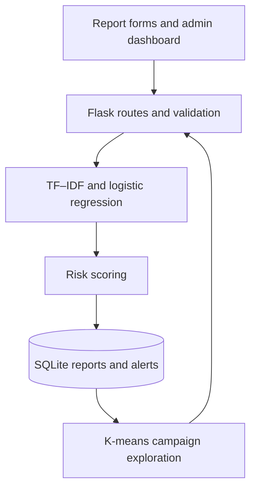

<div align="center">

# 🛡️ ScamShield AI

### Suspicious Message Analysis & Scam Reporting

A Python web application for reporting suspicious messages, assessing risk and exploring related reports.


[Features](#-features) · [Architecture](#-architecture) · [Getting Started](#-getting-started) · [Testing](#-testing)

</div>

---

## 📖 Overview

ScamShield AI is an educational machine-learning project that combines text classification, rule-based risk scoring and report clustering in a Flask web application.

Users can submit suspicious messages with an optional screenshot, view an analysis result and check reported phone numbers. An authenticated administration area provides report management, campaign exploration and alerts.

## ✨ Features

| Area | Capabilities |
| --- | --- |
| Scam reporting | Submit a phone number, message, category and optional screenshot |
| Message analysis | TF–IDF text features and logistic-regression classification |
| Risk assessment | Combine model output with application risk rules |
| Phone lookup | Check report information associated with a phone number |
| Campaign exploration | Group report text using K-means clustering |
| Administration | Dashboard, reports, campaign views and alert management |
| Screenshot uploads | Image-content validation for PNG, JPEG and WebP files |
| Access protection | Admin authentication, CSRF tokens and session-scoped result access |

## 🛠️ Technology Stack

<div align="center">

### Backend & Web


<p>Python · Flask · Jinja2 · HTML · CSS</p>

### Machine Learning & Database


<p>scikit-learn · pandas · NumPy · Pillow · SQLite</p>

</div>

## 🏗️ Architecture

Flask handles report submission, validation and administration. The analysis pipeline converts message text into TF–IDF features for classification, combines results with risk rules, and stores reports in SQLite. Clustering supports exploration of related reports.



| File / folder | Purpose |
| --- | --- |
| `app.py` | Routes, database setup, model training and analysis logic |
| `templates/` | Jinja2 page templates |
| `static/` | Styles and static web assets |
| `data/` | Included message-training dataset |
| `tests/` | Automated security and application-flow checks |
| `requirements.txt` | Python dependencies |
| `.env.example` | Local configuration template |
| `RUN_PROJECT.bat` | Windows setup and launch helper |

## 🚀 Getting Started

### 1. Prerequisites

Install **Python 3.11 or 3.12** with pip. An internet connection is needed for the initial dependency installation.

The project uses **SQLite**; no separate MySQL server, database password or database port is required.

### 2. Create a virtual environment

Open a terminal in the project folder:

```sh
python -m venv .venv
```

On Windows Command Prompt:

```bat
.venv\Scripts\activate.bat
```

On macOS / Linux:

```sh
source .venv/bin/activate
```

Install dependencies:

```sh
python -m pip install -r requirements.txt
```

### 3. Configure the administrator account

Copy `.env.example` to a new file named `.env` in the same folder. Before the first run, set:

```dotenv
ADMIN_USERNAME=admin
ADMIN_PASSWORD=replace-with-a-unique-password
FLASK_DEBUG=0
COOKIE_SECURE=0
```

**Replace the example password with your own unique password of at least 12 characters.** The unchanged placeholder is rejected. Do not commit `.env`.

The first run creates the administrator account using these values. On later runs, editing `ADMIN_PASSWORD` does not reset the existing account. Keep the password you chose for that database.

A session secret is generated automatically. You may optionally configure a stable `SECRET_KEY` in `.env`. `COOKIE_SECURE=0` supports the documented local HTTP setup; use secure cookies when deploying behind HTTPS.

### 4. Start the application

```sh
python app.py
```

- Application: [http://127.0.0.1:5000](http://127.0.0.1:5000)
- Admin login: [http://127.0.0.1:5000/admin/login](http://127.0.0.1:5000/admin/login)
- Admin username: the value of `ADMIN_USERNAME` (default: `admin`)
- Admin password: the password you set before the first run

The first launch initializes the database and trains the model from the included dataset. Keep the terminal open while using the app; press **Ctrl+C** to stop it.

### Windows quick start

Alternatively, run `RUN_PROJECT.bat`. It creates a `venv` environment, installs dependencies and starts the server. If `.env` is missing, it opens the file for configuration. Save your chosen password and close Notepad before continuing.

## 🧪 Testing

From the project root with dependencies installed:

```sh
python -m unittest discover -s tests -v
```

Tests cover page rendering, admin access protection, CSRF enforcement, phone normalization, report-result isolation, invalid-image rejection and the login/logout flow. Tests use a temporary runtime directory separate from local application data.

For a manual check, submit a sample message, view its result, check the phone number and then review the report through the admin dashboard. Use synthetic messages and phone numbers for demonstrations.

## 📂 Local Data

These runtime files are generated automatically and excluded from Git:

| Location | Contents |
| --- | --- |
| `instance/` | SQLite database and generated session secret |
| `models/` | Trained classifier and vectorizer files |
| `uploads/` | Submitted screenshots |

Preserve these folders when retaining local reports. The optional `SCAMSHIELD_DATA_DIR` environment variable can relocate runtime data. Only load model pickle files generated by a trusted source.

## 📌 Model Scope

This project demonstrates English-message classification using the included dataset. It has no published held-out accuracy evaluation or validated Sinhala/Tamil support. Model scores and clusters assist review; they do not establish that a message or person is fraudulent.

Phone formatting is normalized, but local numbers are not automatically converted to an international country code. The Flask development server is intended for local use. Public hosting requires additional abuse prevention, moderation and deployment configuration.

## 👨‍💻 Developer

<h3>Vihanga Thathsara</h3>

<a href="https://github.com/VihangaThathsara">
  
</a>
&nbsp;&nbsp;
<a href="https://www.linkedin.com/in/vihanga-thathsara-00187543b/">
  
</a>

</div>
